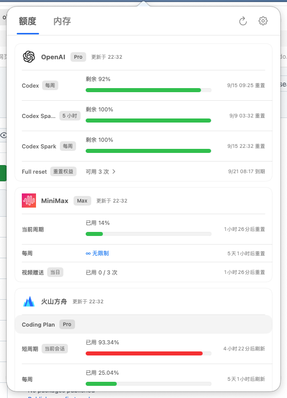
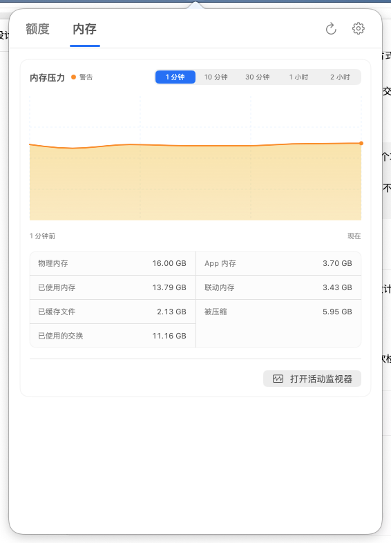

# Usage-Butler（额度管家）

Usage-Butler 是一款 macOS 菜单栏应用，用于在一个界面中查看 AI 编程订阅的额度状态、刷新时间、本机内存和应用网络活动。

> 当前官方支持范围仅覆盖以下 **4 类订阅/套餐的额度展示**：
>
> 1. OpenAI Codex
> 2. MiniMax Token Plan
> 3. 火山方舟 Agent Plan
> 4. 火山方舟 Coding Plan
>
> 它们来自 **3 个 Provider**：OpenAI、MiniMax 和火山方舟。OpenAI CLI 实际返回的 Codex Spark 或其他未知额度桶，可能作为 Codex 概览的明细出现，但不构成新增的官方支持订阅。

本项目只读取和展示额度信息，不提供订阅购买、升级或额度重置能力。

## 当前能力

- 从本机 Provider CLI 读取订阅额度，并展示数据新鲜度与刷新状态。
- 显示系统内存概览和有界的本地历史记录。
- 观察系统可见应用的网络收发速率、分段累计与有界历史，独立保留接口趋势。
- 面板按当前内容自适应高度，超过屏幕可用高度时滚动；切换额度与内存页、显示更多套餐时自动调整。
- 失败时显示重试状态；设置中的脱敏诊断保留最近 7 天、最多 200 条失败与恢复记录。MiniMax 记录字段校验原因和白名单数值，不保存原始输出或账号凭据。
- 菜单栏芯片图标按内存压力显示绿、黄、红；状态未知或数据失效时显示灰色。
- OpenAI 重置权益有多张可用卡片明细时，支持展开查看每张卡的到期时间。
- 支持系统通知；安装并配置 `lark-cli` 后可选用飞书通知。
- Provider 不可用、未登录或数据过期时，显示明确状态，不伪造可用额度。

## 网络观察 v2

0.3.0（3）新增原生上下行分区独立刻度、五档范围、共享游标、源侧两小时有界历史与各方向独立累计起点。0.3.1（4）修复普通应用读取系统字节数的 32 位截断，改用公开 IFMIB 的完整计数；历史提醒只针对所选范围内的实际中断，裸 Tab 可从网络页返回额度。0.3.2（5）修正时间范围按钮的完整点击区域，把接口选择和统计说明移到独立网络设置页，取消主面板折叠和游标导致的高度变化。0.3.3（6）修复跨异步操作的启停、接口当前存在状态、路径单调时效、设置演示标识及峰值零/未知语义；图表保留稳定点/段身份，缓存投影并独立更新游标。

0.3.x 阶段仅观察系统接口，应用交互属于明确标识的 Debug 演示；历史范围见[0.3.3 需求与边界](docs/network-v0.3.3-requirements.md)。

0.3.4（7）修复网络趋势持续刷新时轴标签累积的内存问题，保留原始时间、速率与辅助功能语义；复现与验收边界见[内存整改](docs/network-memory-regression.md)。

0.3.5（8）将采集状态/开关、统计对象和能力说明集中到“设置 → 网络”；主面板正常时直接显示趋势，保留停止、过期和范围内历史中断提示。[展示调整与应用统计接入边界](docs/network-panel-and-app-observation.md)。

0.4.0（9）接入系统 `nettop` 的真实进程收发字节，以可验证的进程启动身份和应用包位置分组。网络页支持应用搜索、排序、本次运行关注、详情趋势及本地脱敏 JSON 导出，接口趋势独立保留。统计含回环和代理进程，只覆盖实际观测到的连续样本；连接、域名和阻断能力尚未实现。历史最多两小时，并受全局资源预算限制。口径与限制见[应用网络观察合同](docs/network-panel-and-app-observation.md)。

0.4.1（10）修正长期运行的自动恢复预算：保留 2/4/6 秒、最多三次未稳定恢复的退避；同一来源会话连续取得至少 60 秒可信完整采样后补回预算。新增只含固定原因码和有限数值的本地生命周期日志，便于区分来源终止、自动重试、预算耗尽与稳定恢复。

同版修正 CSV 行内控制字符校验、相邻采样周期的连续性与溢出原因保留；JSON 墙钟保留毫秒，应用详情就地解释每方向的累计起点和重新起算原因。

0.5.0（11）加入当前登录用户的独立后台采集：主程序退出后可继续保存实际观察到的应用流量，默认保留14天分钟记录。可调大小的原生历史窗口支持1小时、24小时、7天和14天范围、应用汇总、上传活动筛选及别名化JSON导出。最近1分钟使用原始采样，更长趋势使用分钟均速并单列真实采样峰值。后台可在网络设置中独立停止，已提交历史仍可只读查询；未采集、休眠、注销和关机期间不补造流量。

0.5.1（12）减少主程序接口趋势历史的重复分配：已带源连续性标识的有界批次与界面共享不可变数组，后续采样通过写时复制保持旧快照不变；恢复采集后释放停止状态的备用副本。仍保留每接口最多7200个源点、两小时单调时间期限及原有五档范围，旧格式历史继续补齐连续性标识。

0.5.2（13）按查询范围内实际观察次序选择应用历史名称，旧数据明确标记身份顺序未验证；过期清理分片执行，避免一次清理阻塞持续来源。后台请求的业务错误、取消和超时分别隔离；新连接先完成最小状态握手，停止失败保留未确认状态。

## 界面预览

### 订阅额度

集中查看各服务的额度与刷新时间；有多张可用重置卡明细时，可展开查看各自的到期时间。



### 内存概览

查看内存压力趋势、不同时间范围及内存使用明细。



截图中的套餐、额度与时间仅代表拍摄时的状态，不代表每个账号都拥有相同权益。

### 菜单栏的四种内存状态

芯片轮廓保持不变，中心颜色随系统内存压力变化。下图使用应用实际绘制的图标，并放大展示。

| 正常 | 警告 | 严重 | 未知／数据失效 |
| :---: | :---: | :---: | :---: |
|  |  |  |  |
| 绿色 | 黄色 | 红色 | 灰色 |

颜色表达的是**内存压力状态**，不按内存占用百分比划分；采样超过 30 秒未更新时显示灰色。

## 环境要求

- macOS 13 或更高版本
- Xcode（支持 Swift 6）
- Swift 6
- [XcodeGen](https://github.com/yonaskolb/XcodeGen) 2.45.4 或更高版本
- 按需安装并登录以下本机 CLI：
  - `codex`：OpenAI Codex
  - `mmx`：MiniMax Token Plan
  - `arkcli`：火山方舟 Agent Plan / Coding Plan
  - `lark-cli`：可选，仅用于飞书通知

各 CLI 由对应项目独立提供和授权，本仓库不包含这些 CLI，也不代替其登录流程。

## 构建与验证

在仓库根目录执行：

```bash
# 验证 XcodeGen 生成结果稳定，并列出工程配置
./script/verify_generated_project.sh

# 生成工程并运行单元测试
./script/test.sh

# 生成、构建并启动 Debug 应用
./script/build_and_run.sh
```

`UsageButler.xcodeproj` 是生成产物，不纳入版本控制。

构建启动脚本会先签内嵌后台程序，再签主应用并严格验证。默认使用本地ad-hoc签名；可用 `USAGE_BUTLER_CODESIGN_IDENTITY` 指定本机现有开发签名身份。后台跨构建升级需验证标准SM注销/注册、稳定签名标识和原历史读回；开发签名不代表Developer ID分发或公证。详见[后台与历史合同](docs/network-panel-and-app-observation.md)。

## 隐私与本地数据

- 应用和仓库不内置 Provider token、API key、Cookie 或用户登录资料。
- Provider 登录状态由本机的 `codex`、`mmx` 和 `arkcli` 管理。调用这些 CLI 时，CLI 可能按照其自身行为连接对应 Provider 网络。
- 规范化后的额度缓存写入 `~/Library/Application Support/Usage-Butler/quota-cache/v1/`。
- 内存历史写入 `~/Library/Application Support/Usage-Butler/memory-history/v1/`。
- 应用网络分钟历史保存在 `~/Library/Application Support/io.github.obisoldbee.UsageButler/NetworkHistory/history-v1.sqlite`；后台遵循当前用户的系统批准和停止意图。数据包含本地应用身份、已观察字节与覆盖状态，不保存网络载荷或连接目标。
- 开关、刷新周期、CLI 路径、通知去重标记等偏好通过 macOS `UserDefaults` 保存到应用标识 `io.github.obisoldbee.UsageButler` 的偏好域。
- 系统通知只在本机显示。飞书通知是可选功能；启用后，通知内容会由本机 `lark-cli` 发送到用户配置的目标会话。

仓库不预置飞书会话 ID。需要飞书通知时，可由用户在本机显式配置：

```bash
defaults write io.github.obisoldbee.UsageButler \
  usageButler.settings.v1.quotaAlerts.larkChatID "oc_your_chat_id"
```

未配置有效目标会话时，飞书通知不会启用，系统通知仍可使用。删除配置可执行：

```bash
defaults delete io.github.obisoldbee.UsageButler \
  usageButler.settings.v1.quotaAlerts.larkChatID
```

## 发布状态

当前版本是开发预览版。仓库暂不提供可下载的 Release 二进制；本地脚本生成的是未签名、未经过 Apple 公证的开发构建，不应视为正式分发包。

## 许可证

代码使用 [MIT License](LICENSE) 开源。第三方产品名称和商标的归属说明见 [NOTICE.md](NOTICE.md)。
